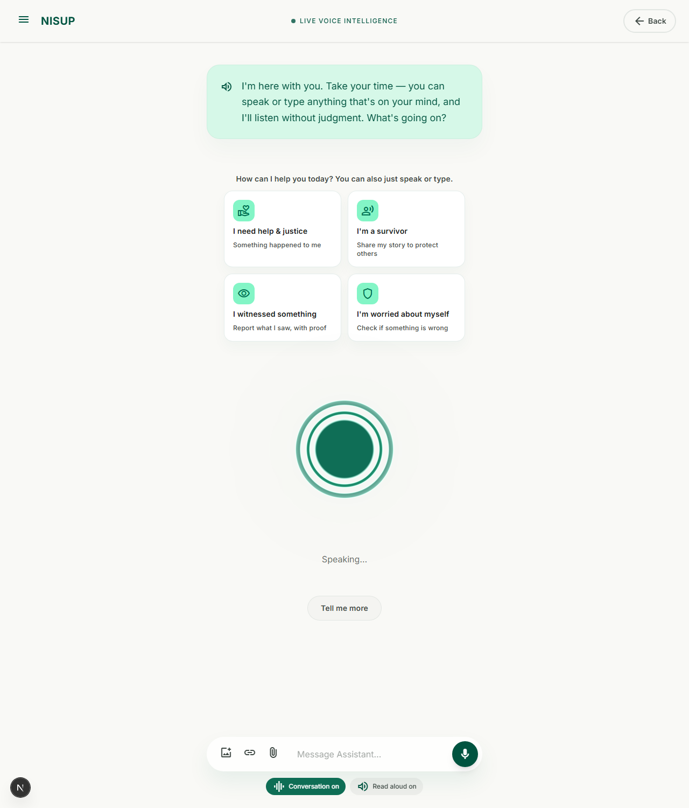
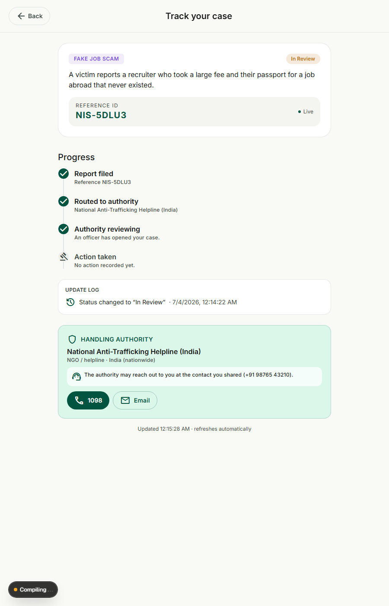
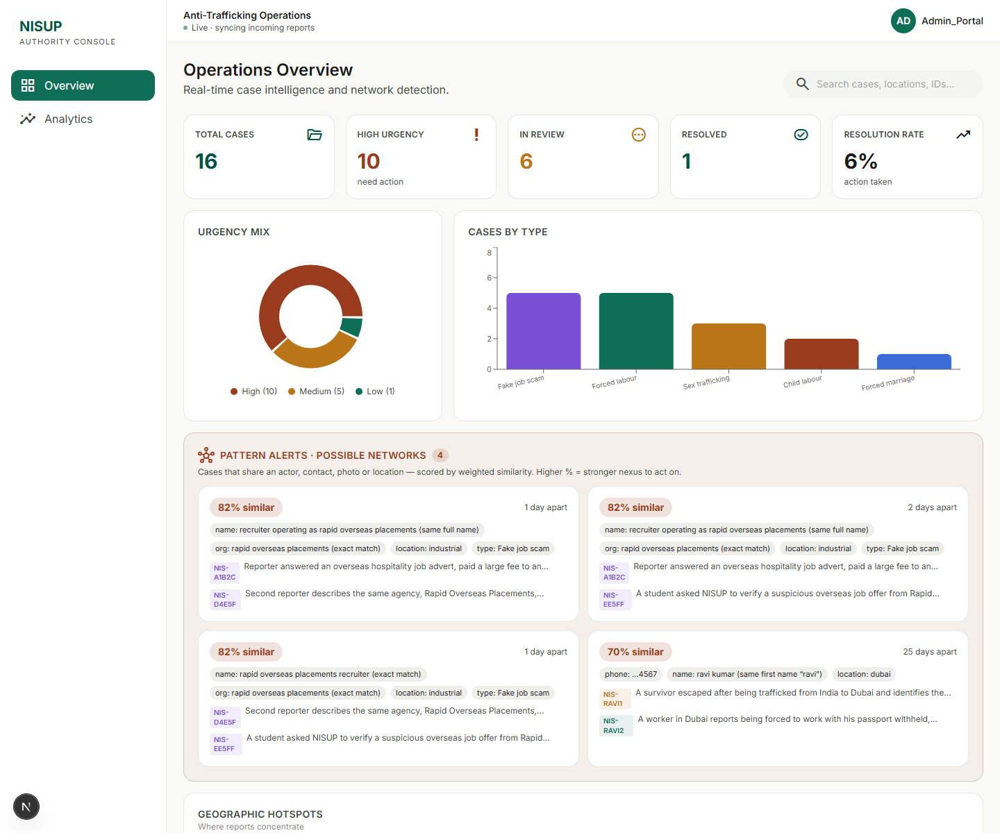

# NISUP — Call for Code 2026 (Austin AI Hub)

> **A safe voice to talk to.**
> A voice-first, trauma-informed AI platform for people affected by human trafficking — and an intelligence console that helps authorities connect the dots no fragmented system can.

<p>
  <a href="https://nisup-call-for-code-2026-austin-ai.vercel.app"></a>
  <a href="https://github.com/swastikaggarwal/NISUP-Call-for-Code-2026-Austin-AI-HUB"></a>
</p>

🔗 **Live app:** https://nisup-call-for-code-2026-austin-ai.vercel.app <br>
📦 **Repository:** https://github.com/swastikaggarwal/NISUP-Call-for-Code-2026-Austin-AI-HUB <br>
🛠️ **Built with:** Next.js 16 · Groq (Llama 3.3 70B) · RAG · Web Speech API · Recharts · Leaflet

---

## 🌿 What is NISUP?

NISUP is a **voice-first AI assistant** — think of Siri, but built for the most vulnerable moment of a person's life. Anyone affected by human trafficking can simply **talk** to NISUP, in their own language, and be heard without judgment.

There are no forms to fill, no categories to choose, no offices to face. NISUP understands who the person is through natural conversation, gives grounded guidance, gathers evidence at the person's own pace — and, **with their consent, files a formal case to the right authority on their behalf**, complete with a case number and live tracking.

Behind the conversation sits an **intelligence layer**: every report is analysed for warning signs and cross-matched against every other report — so that two victims naming the same trafficker, weeks apart, in different languages, become **one connected case** that authorities can act on.

---

## 👥 Who is NISUP for?

| Who | What NISUP does for them |
|---|---|
| 🕊️ **Survivors** | People who escaped trafficking and want their voice to protect others — share their story safely (anonymous by default), raise alerts, and turn their experience into evidence that helps catch perpetrators. |
| ⚖️ **Victims seeking help & justice** | People currently trapped — a fake job that took their passport, forced labour, exploitation — who don't know whom to contact or where to go. NISUP guides them, files the complaint **for** them, and gives them a trackable case. |
| 🛡️ **At-risk individuals** | People who sense something is wrong — a suspicious job offer, being followed, a situation that "doesn't feel right." NISUP helps them recognise warning signs early and checks whether similar cases already exist, **before** they become victims. |
| 👁️ **Witnesses** | Anyone who saw something — a child working in a shop, workers who can't leave a site — and wants to report it with photo proof to the right authority, easily and safely. |
| 🏛️ **Authorities & NGOs** | Police units, labour inspectorates, child protection services and helplines receive structured, AI-briefed, risk-prioritised cases — with network patterns detected automatically across all reports. |

*One assistant serves them all — nobody is ever asked to label themselves.*

---

## 💔 The issue we are solving

**An estimated 99.7% of trafficking victims are never identified.** Four structural failures cause this:

1. **Trafficking is designed to be invisible** — it hides inside ordinary economic activity: restaurants, farms, construction sites, private homes.

2. **Victims often don't self-identify** — debt, fear, cultural pressure and gradual escalation blur the line between exploitation and "a bad job."

3. **Language & immigration barriers** — victims fear deportation more than they trust authorities. That silence is the trafficker's strongest weapon.

4. **Fragmented detection systems** — labour inspectors see workplaces, police see sex trafficking, healthcare sees injuries. **No single agency sees the full picture, and no one connects the dots across silos.**

And even when a victim *is* ready to speak: helplines are scattered, complaint systems differ by country and agency, and a person in danger is rarely in a state to navigate any of it.

---

## 💡 Our solution

### 1. 🎙️ A voice anyone can talk to

Browser-native voice conversation (speak **and** listen) in 5 languages — English, हिन्दी, Español, العربية, বাংলা — with hands-free turn-taking and instant response. Typing works too. No app install; runs on any phone browser.



### 2. 🚦 Intelligent flag triage (green / amber / red)

Every message is silently scored against real trafficking indicators (passport confiscation, confinement, debt bondage, threats, minors involved…):

- 🟢 **Just a doubt?** Clear answer, practical checkpoints, warm close — no case pushed. Optionally saved as a **private note**.
- 🟡 **One concern?** A clarifying question + a clear "come back if X happens" tripwire.
- 🔴 **Serious danger signs?** NISUP names the pattern plainly and makes a firm, consent-based offer to **file the report for them** — because a person in danger is not in a state to do it alone.

### 3. 📋 Filing a case, the humane way

NISUP drafts the complaint from the conversation — with attached **voice recordings and photo evidence** — matches the right authority, and files it on consent. The person receives a **Case ID**, a shareable **case article**, and a **live tracking page**: *filed → routed → authority reviewing → action taken*, updating in real time as the authority acts.



### 4. 🕸️ Nexus detection — connecting the dots

The flagship. Every case is cross-matched against every other by **phones, emails, names (fuzzy), organisations, photo evidence (perceptual image hash), locations and case type**, producing a similarity score. A survivor's case naming *"Ravi Kumar, Dubai, +971 50…"* and a new victim's report weeks later naming the same man → **"86% similar"** with the exact shared signals. The victim gets validation — *"you are not alone"* — and the authority gets a prosecutable network instead of two isolated complaints.

### 5. 🏛️ The Authority Console

A real-time intelligence dashboard: Pattern Alerts with match percentages, 🚩 risk-prioritised incoming cases, AI-written case briefs, live map, hotspots and resolution analytics — auto-refreshing as reports arrive.

### 6. 🔐 Privacy by design

Nothing filed without consent. Anonymity on by default. Private notes never reach any authority surface. Strict anti-hallucination rules — the AI never invents names, facts or contacts.

---

## 👁️ Making the Invisible Visible

Trafficking survives by staying unseen — hidden in ordinary workplaces, scattered across disconnected complaint systems, buried in languages authorities don't speak. **Every feature of NISUP is built to drag it into the light:**

| Invisible… | …made visible by NISUP |
|---|---|
| A victim who can't name what's happening to them | 🚦 **Flag triage** — the conversation itself detects the pattern (passport taken + can't leave + debt = forced labour) and names it, gently |
| A trafficker operating across two cities — or two countries | 🕸️ **Nexus detection** — every case cross-matched by phone, email, name, photo and place → *"86% similar · 25 days apart"* |
| The scale and shape of trafficking in a region | 📊 **The intelligence console** — live, visual, at a glance |
| A child working in a shop nobody reports | 👁️ **Zero-friction witness reporting** with photo evidence, routed to child protection |
| A case that disappears into a complaint box | 📍 **Live tracking** — every report visibly moves: filed → routed → reviewing → action taken |

### 📊 The data that speaks — our visual intelligence layer

The Authority Console turns raw reports into **interactive data visualizations that make the scale of trafficking visceral and comprehensible**:



- **🕸️ Pattern Alert cards** — scored network links between cases (*"82% similar"*), showing the exact shared signals: same phone, same recruiter name, same photo, same district — the network made visible.
- **🗺️ Live case map** — every report as a colour-coded marker by trafficking type; clusters appear where exploitation concentrates.
- **📈 Geographic hotspot ranking** — which neighbourhoods and hubs reports concentrate in, ranked and proportioned.
- **🍩 Urgency mix donut** — how much of the caseload is High / Medium / Low urgency, at one glance.
- **📊 Cases-by-type & cases-over-time charts** — is fake-job recruitment spiking? Is child labour trending down after a raid?
- **🚩 Risk-flag badges & triage-sorted feed** — red-flagged cases float to the top with their indicator count, so the 5 cases that can't wait are seen first among 50.
- **🧮 KPI tiles** — total cases, high urgency, in review, resolved, and **resolution rate** — accountability, quantified.

All of it **live** — the dashboard re-syncs every 5 seconds as new voices come in.

---

## 🎬 Product Feature Demo — sample cases

*Real flows you can reproduce on the [live app](https://nisup-call-for-code-2026-austin-ai.vercel.app) right now.*

### Sample 1 · 🟢 A doubt, not a case

> **User:** "An agency offered my cousin a job but asks a ₹2,000 registration fee — is that normal?"
>
> **NISUP:** explains that genuine employers rarely charge fees, gives concrete checkpoints (verify the licence, never surrender original documents, written contract before payment) — and closes warmly. **No case filed, no pressure.** Optional *private note* saved, invisible to authorities.

*What this shows: NISUP respects people's time and never manufactures cases.*

### Sample 2 · 🔴 Red flags → a case filed by voice alone

> **User:** "The agent took my passport at the airport. The door is locked at night, and they say I owe $3,000 for the visa so I can't quit."
>
> **NISUP:** 🚩 detects **3 red flags** (documents confiscated · confinement · debt bondage), names the pattern — *"together these are the pattern of forced labour, and this is not your fault"* — and offers firmly: *"I can file this report for you right now."* On "yes": auto-drafted complaint → **Case ID** → live tracking page with the handling authority's tap-to-call contacts.

*What this shows: someone in danger files a complete, evidence-backed case without facing any office — just by talking.*

### Sample 3 · 🕸️ The nexus — two voices, one trafficker

> **June 5:** A survivor shares her story — trafficked from India to Dubai by *"Ravi Kumar"*, phone *+971 50 123 4567*.
>
> **June 30:** A new victim reports forced labour in Dubai — *"the man who brought me here is called Ravi, his number is +971 50 123 4567."*
>
> **The victim instantly sees:** 💬 *"I've seen a related case — 86% match. You are not alone in this."* → can read the survivor's case article.
>
> **The authority instantly sees:** 🕸️ Pattern Alert — *"86% similar · 25 days apart · shared: phone, name, location"* → two isolated reports become **one prosecutable network**.

*What this shows: the dots no fragmented system could connect — connected in seconds.*

### Sample 4 · 🏛️ The authority acts — and the victim sees it

> An officer opens the red-flagged case (🚩 3 indicators + AI-written brief), changes status to **In Review** → within seconds the victim's **tracking page** updates: *"Authority reviewing — an officer has opened your case."*

*What this shows: transparency both ways — reports don't vanish into a void.*

### ▶️ Try it yourself (2 minutes)

1. Open the **[live app](https://nisup-call-for-code-2026-austin-ai.vercel.app)** → **Begin** (Chrome/Edge, allow the microphone).
2. Reproduce **Sample 1** (green) — then tap the NISUP logo to start over and reproduce **Sample 2** (red) and **Sample 3** (nexus).
3. Open **/dashboard/overview** (any login — demo mode) to see the Pattern Alerts, the map, and the 🚩 triage feed.

---

## 🏘️ What we solve locally

- A person in **one city** gets, in one conversation: recognition of their situation, the *right* local authority (labour inspectorate vs. police anti-trafficking unit vs. child protection vs. NGO helpline), and a filed, trackable case.
- Local authorities see **geographic hotspots** and repeated actors in their jurisdiction — the recruiter scamming one neighbourhood becomes visible after the second report, not the twentieth.
- Witnesses finally have a **zero-friction way** to report the child working in a nearby shop — with photo proof routed to child protection, not lost in a generic complaint box.

---

## 🌍 What we solve globally

- **Trafficking is transnational** — a victim recruited in India and exploited in Dubai falls between two countries' systems. NISUP's case intelligence doesn't care about borders: the nexus engine links the Indian survivor's story with the Dubai victim's report automatically.
- **Language is no longer a filter** — a Bengali-speaking victim and a Spanish-speaking witness feed the same intelligence layer.
- Every shared case article and community alert becomes **global prevention** — the fake agency exposed by one survivor warns the next target in another country.

---

## 🔭 Future scope

Today, NISUP is a **web platform** — the assistant, case filing, live tracking and the authority console all run in the browser. Our vision is bigger:

- ☎️ **One universal helpline number, worldwide.** A single, memorable number — like 911 or 112, but for trafficking — reachable by **voice call from any phone, in any country, by any nationality**. The same NISUP intelligence answers: triage, evidence capture, and instant case filing, with no app or internet required. Help becomes immediate, wherever you are.
- 🌐 **Cross-border authority coordination.** When a nexus spans two states or two countries (recruited in one, exploited in another), **both** authorities are alerted with each other's case brief and contacts — enabling mutual coordination and **immediate joint action** instead of parallel dead-ends.
- 🤝 **Per-agency dashboards** with verified authority onboarding and real intake API integrations.
- 🗄️ **Durable encrypted database**, vector-embedding retrieval, face-aware evidence matching, and SMS/email status notifications for reporters.

---

## 🧠 How the AI works

| Layer | What it does |
|---|---|
| **Groq · Llama 3.3 70B** | The conversational brain — trauma-informed persona, ~1s replies (voice UX needs speed) |
| **RAG retriever** (`lib/rag.ts`) | TF-IDF retrieval over a curated knowledge base of case examples + guidance, injected per turn |
| **Structured extraction** (`/api/extract`) | Conversation → case record JSON: type, people, contacts, urgency, **risk band + red flags**, authority brief |
| **Triage steering** | The current risk band feeds back into the system prompt — green concludes, amber clarifies, red offers firmly |
| **Nexus engine** (`lib/similarity.ts`, `lib/nexus.ts`) | Weighted entity matching: phone/email (strong), fuzzy names, orgs, **perceptual image hashing** (`sharp`), location, type → match % |
| **Pattern alerts** (`/api/patterns`) | All-pairs scan across the case store → scored network alerts for the console |

---

## 🚀 Run it locally

```bash
git clone https://github.com/swastikaggarwal/NISUP-Call-for-Code-2026-Austin-AI-HUB.git
cd NISUP-Call-for-Code-2026-Austin-AI-HUB
npm install
copy .env.example .env.local   # then add your key inside (see below)
npm run dev                    # → http://localhost:3000
```

**Environment variable** (`.env.local`):

| Variable | Where to get it |
|---|---|
| `GROQ_API_KEY` | Free at https://console.groq.com → API Keys |

Use **Chrome/Edge** and allow the microphone for voice. Without a key the app still runs; the assistant answers with a calm fallback.

---

## 🏗️ Architecture

```
app/
├─ assistant/          # voice UI: shader orb, hands-free loop, triage cards
├─ case/[id]/          # public case article (recordings, evidence, nexus)
├─ track/[id]/         # live tracking (timeline, authority contacts)
├─ dashboard/          # authority console (overview, analytics, case detail)
├─ alerts | stories | reports | emergency | privacy
└─ api/                # chat · extract · report · nexus · patterns ·
                       # case-status · classify · match · cases   (all server-side)

lib/    # prompts, RAG, similarity/nexus, entities, pHash, speech, store
data/   # knowledge base, authorities, sample cases, alerts, stories
```

**MVP scope (intentional):** in-memory + JSON persistence (`// TODO: real DB`), mock authority login, LLM-as-retriever RAG (upgrade path: vector embeddings). On the free hosting tier, newly filed cases persist per session; seeded demo data is always available.

---

## 🏆 Call for Code 2026 — Austin AI Hub

NISUP exists because the first step against trafficking is being **found** — and being found starts with having a safe voice to talk to.
